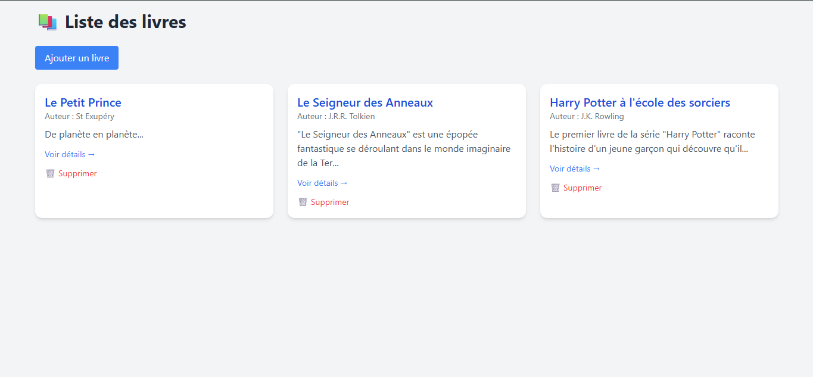
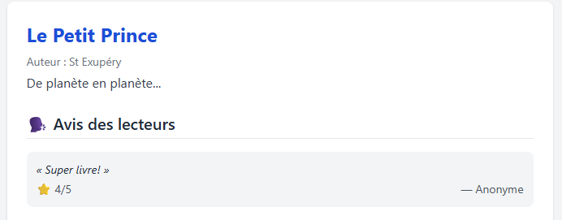
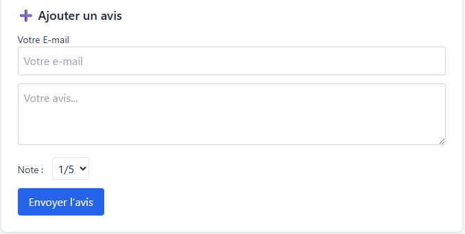

# Book Management Project

## Description

Le projet **Book Management** permet de gérer des livres, de laisser des avis et de visualiser les informations relatives aux livres et leurs avis. L'application offre les fonctionnalités suivantes :

- Ajouter un livre
- Lister les livres
- Ajouter des avis pour chaque livre
- Visualiser les détails d'un livre (titre, auteur, description, avis)

L'application utilise Laravel pour la partie backend et Blade pour les templates frontend.

## Installation

### Prérequis

1. PHP >= 7.4
2. Composer
3. MySQL ou MariaDB

### Étapes d'installation

1. **Clonez le dépôt** :

```bash
   git clone https://github.com/tourad009/Book-management.git
   cd Book-management
```

2. **Installez les dépendances avec Composer** :
```bash
   composer install
```

3. **Installez les dépendances avec Composer** :
```bash
   php artisan key:generate
```

4. **Configurez la base de données dans le fichier .env**:

```bash
   DB_CONNECTION=mysql

    DB_HOST=127.0.0.1

    DB_PORT=3306

    DB_DATABASE=nom_de_votre_base

    DB_USERNAME=votre_utilisateur

    DB_PASSWORD=votre_mot_de_passe
```

5. **Exécutez les migrations** :
```bash
   php artisan migrate
```

6. **Démarrez le serveur** :
```bash
   php artisan serve
```

## Description des Tables

### Table `books`

Cette table contient les informations relatives aux livres.

- `id` (INT, auto-increment) : Identifiant unique du livre.
- `title` (VARCHAR) : Titre du livre.
- `author` (VARCHAR) : Auteur du livre.
- `description` (TEXT) : Description du livre.
- `created_at` (TIMESTAMP) : Date et heure de création.
- `updated_at` (TIMESTAMP) : Date et heure de la dernière mise à jour.

### Table `reviews`

Cette table contient les avis laissés par les utilisateurs pour chaque livre.

- `id` (INT, auto-increment) : Identifiant unique de l'avis.
- `content` (TEXT) : Contenu de l'avis.
- `rating` (INT) : Note de l'avis (de 1 à 5).
- `user_id` (INT, FK) : Identifiant de l'utilisateur ayant laissé l'avis.
- `book_id` (INT, FK) : Identifiant du livre auquel l'avis est lié.
- `created_at` (TIMESTAMP) : Date et heure de création.
- `updated_at` (TIMESTAMP) : Date et heure de la dernière mise à jour.

### Table `users`

Cette table contient les informations des utilisateurs qui laissent des avis (en l'absence d'authentification).

- `id` (INT, auto-increment) : Identifiant unique de l'utilisateur.
- `name` (VARCHAR) : Nom de l'utilisateur.
- `email` (VARCHAR) : Email de l'utilisateur.
- `created_at` (TIMESTAMP) : Date et heure de création.
- `updated_at` (TIMESTAMP) : Date et heure de la dernière mise à jour.

## Fonctionnalités

### Ajouter un livre

Un administrateur peut ajouter un livre via un formulaire avec les informations suivantes : titre, auteur, description.

### Lister les livres

Les utilisateurs peuvent voir tous les livres disponibles dans la base de données.

### Ajouter un avis

Les utilisateurs peuvent ajouter un avis pour un livre, y compris un commentaire et une note (de 1 à 5 étoiles).

### Visualiser un livre

Les utilisateurs peuvent cliquer sur un livre pour afficher ses détails, y compris les avis des autres utilisateurs. Un formulaire pour ajouter un avis est également présent.

## Capture d'écran

### Page d'accueil



### Détail d'un livre



### Formulaire d'ajout d'avis

